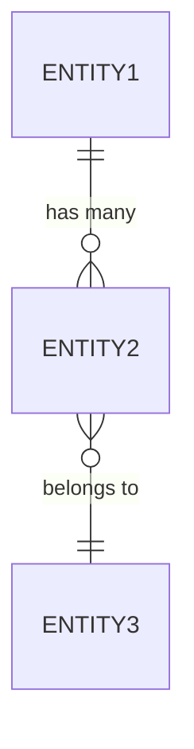
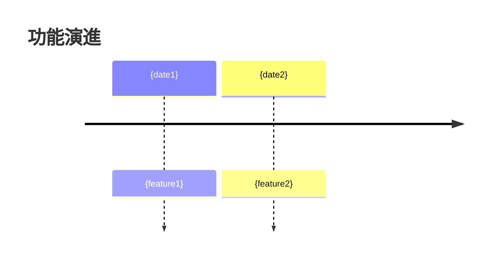

# Skill: 從原始碼與 Git Log 反向工程產出 Spec Kit 格式規格文件

> 本 Skill 結合 [GitHub Spec Kit](https://github.com/github/spec-kit) 的 SDD（Specification-Driven Development）文件格式，
> 針對「既有專案」進行反向工程，從原始碼結構與 Git 歷史紀錄中提取規格，產出一組完整的 Spec Kit 相容文件。

---

## 產出文件結構

```text
specs/reverse-engineered/
├── constitution.md      # 專案架構原則（從程式碼慣例推斷）
├── spec.md              # 功能規格（從程式碼 + git log 提取）
├── plan.md              # 技術架構與實作現況
├── data-model.md        # 資料模型（從 ORM/Schema/Migration 提取）
├── contracts/           # API 合約（從路由/Controller 提取）
│   ├── rest-api.md
│   └── events.md
├── tasks.md             # 現有功能的任務拆解與狀態
├── research.md          # 技術棧研究與依賴分析
├── quickstart.md        # 關鍵驗證場景
└── checklist.md         # 規格完整性檢核
```

---

## 一、前置資料收集

### 1.1 專案結構掃描
```bash
# 目錄樹（排除非核心目錄）
find . -type f \
  -not -path './.git/*' \
  -not -path './node_modules/*' \
  -not -path './vendor/*' \
  -not -path './__pycache__/*' \
  -not -path './.venv/*' \
  | head -300 > project_tree.txt
```

### 1.2 Git 歷史提取
```bash
# 完整提交歷史（JSON 格式）
git log --pretty=format:'{"hash":"%h","date":"%ad","author":"%an","subject":"%s"}' \
  --date=short > git_history.json

# 依 Conventional Commits 分類
git log --grep='^feat'     --pretty=format:'- [%h] %s (%ad)' --date=short > _feat.txt
git log --grep='^fix'      --pretty=format:'- [%h] %s (%ad)' --date=short > _fix.txt
git log --grep='^refactor' --pretty=format:'- [%h] %s (%ad)' --date=short > _refactor.txt
git log --grep='BREAKING'  --pretty=format:'- [%h] %s (%ad)' --date=short > _breaking.txt

# 高頻變更檔案（識別核心模組）
git log --format= --name-only | sort | uniq -c | sort -rn | head -30 > hot_files.txt

# 高修復頻率檔案（識別技術債）
git log --grep='^fix' --format= --name-only | sort | uniq -c | sort -rn | head -20 > fix_hotspots.txt

# 貢獻者分析
git shortlog -sn --no-merges | head -20 > contributors.txt

# 版本標籤
git tag --sort=-version:refname > tags.txt

# TODO/FIXME/HACK 掃描
grep -rn 'TODO\|FIXME\|HACK\|XXX' \
  --include='*.ts' --include='*.js' --include='*.py' \
  --include='*.go' --include='*.java' --include='*.rs' \
  . > tech_debt.txt 2>/dev/null
```

---

## 二、分析策略（階層式展開）

| 層級 | 分析對象 | 對應 Spec Kit 文件 |
|------|---------|-------------------|
| **L0 - 專案層** | README、設定檔、進入點 | `constitution.md` + `plan.md` 概觀 |
| **L1 - 模組層** | 頂層目錄、package 劃分 | `plan.md` Project Structure |
| **L2 - 功能層** | 路由、Handler、測試檔案名 | `spec.md` User Stories |
| **L3 - 介面層** | 公開 API、函式簽章 | `contracts/` |
| **L4 - 資料層** | ORM Model、Schema、Migration | `data-model.md` |
| **L5 - 演進層** | Git log、tag、blame | `research.md` + `tasks.md` |

---

## 三、各文件產出模板與指引

### 3.1 `constitution.md` — 專案架構原則

> **來源**：從程式碼慣例、設定檔、CI/CD 配置、README 中推斷

```markdown
# {專案名稱} Constitution

> ⚠️ 本文件由原始碼反向工程產出，標記 [推斷] 的項目需人工確認

## Core Principles

### I. {原則名稱，如：模組化架構}
[從目錄結構與程式碼組織推斷的架構原則]
[推斷依據：{具體檔案路徑或 pattern}]

### II. {原則名稱，如：測試策略}
[從測試目錄結構與測試框架推斷的測試原則]
[推斷依據：{測試框架設定檔、測試目錄結構}]

### III. {原則名稱，如：API 設計風格}
[從路由定義與 API 實作推斷的介面設計原則]
[推斷依據：{路由檔案、中介層設定}]

## Development Workflow
[從 CI/CD 設定、git hooks、branch 策略推斷]
[推斷依據：{.github/workflows/、.gitlab-ci.yml、Makefile}]

## Quality Gates
[從 lint 設定、pre-commit hooks、CI 檢查推斷]
[推斷依據：{eslint/prettier/ruff 設定檔}]

## Governance
- 本 Constitution 由原始碼反向工程產出於 {DATE}
- 基於 commit {HASH} 版本分析

**Version**: 1.0.0-reverse-engineered | **Created**: {DATE}
```

---

### 3.2 `spec.md` — 功能規格

> **來源**：Git feat commits + 路由/Controller + 測試檔案名稱

```markdown
# Feature Specification: {專案名稱} — 反向工程規格

**Created**: {DATE}
**Status**: Reverse-Engineered Draft
**Source**: 原始碼分析 + Git Log (commit {HASH})

## User Scenarios & Testing *(mandatory)*

<!--
  從以下來源提取 User Story：
  1. git log --grep='^feat' 的功能提交，按模組分群
  2. 路由/Controller/Handler 端點定義
  3. 測試檔案名稱與測試描述（describe/it/test blocks）
  4. README 中描述的功能

  每個 User Story 必須標注：
  - 來源：[git commit / 程式碼路徑 / 測試檔案]
  - 信心度：[高/中/低] — 基於證據充分程度
-->

### User Story 1 - {功能標題} (Priority: P1)

{從程式碼與 commit 歷史推斷的使用者旅程描述}

**來源證據**：
- Commit: {hash} - {commit message}
- 程式碼: {file path}
- 測試: {test file path}

**信心度**: [高/中/低]

**Why this priority**: {從 commit 頻率、依賴關係、入口點位置推斷}

**Independent Test**: {從既有測試案例提取，或從程式碼行為推斷}

**Acceptance Scenarios**:

1. **Given** {從測試案例或程式碼邏輯提取的前置條件}, **When** {觸發動作}, **Then** {預期結果}
2. **Given** {前置條件}, **When** {動作}, **Then** {結果}

---

### User Story 2 - {功能標題} (Priority: P2)
{依此格式繼續...}

---

### Edge Cases
- {從錯誤處理程式碼、catch blocks、validation 邏輯提取}
- {從 fix commits 中歸納的邊界條件}

## Requirements *(mandatory)*

### Functional Requirements
<!--
  從程式碼中提取，每條需求標注來源檔案
-->
- **FR-001**: System MUST {capability} — *來源: {file:line}*
- **FR-002**: System MUST {capability} — *來源: {file:line}*
- **FR-003**: Users MUST be able to {interaction} — *來源: {file:line}*
- **FR-00N**: {capability} — [NEEDS CLARIFICATION: 程式碼中存在但意圖不明]

### Key Entities

- **{Entity 1}**: {描述與屬性} — *來源: {model file}*
- **{Entity 2}**: {描述與關聯} — *來源: {model file}*

## Success Criteria *(mandatory)*

### Measurable Outcomes
<!--
  從測試斷言、效能設定、監控配置中推斷
-->
- **SC-001**: {指標} — *來源: {test/config file}*
- **SC-002**: {指標} — [推斷，待確認]

## Assumptions

- {從 .env.example、設定檔、依賴推斷的假設}
- {從 README 提取的範圍限制}
- {從程式碼中未處理的情境推斷}
```

---

### 3.3 `plan.md` — 技術架構與實作現況

> **來源**：設定檔 + 目錄結構 + 依賴清單

```markdown
# Implementation Plan: {專案名稱} — 現況描述

**Date**: {DATE} | **Spec**: [./spec.md](./spec.md)
**Source**: 原始碼結構分析

## Summary

{從 README + 入口點程式碼提取的專案摘要}

## Technical Context

**Language/Version**: {從 package.json/pyproject.toml/go.mod 提取}
**Primary Dependencies**: {從 lock file 提取前 10 個核心依賴}
**Storage**: {從 ORM 設定/連線字串/migration 推斷}
**Testing**: {從測試框架設定推斷}
**Target Platform**: {從 Dockerfile/deploy 設定推斷}
**Project Type**: {library/cli/web-service/mobile-app/...}
**Constraints**: {從設定檔/環境變數推斷}

## Constitution Check

<!--
  基於反向工程的 constitution.md 進行自我檢核
-->

- [x] {已符合的原則} — 驗證於 {file}
- [ ] {未明確符合的原則} — [NEEDS CLARIFICATION]

## Project Structure

### Documentation (this feature)

```text
specs/reverse-engineered/
├── spec.md
├── plan.md
├── research.md
├── data-model.md
├── contracts/
├── tasks.md
├── quickstart.md
└── checklist.md
```

### Source Code (實際結構)

```text
{貼上 project_tree.txt 的關鍵部分，標注各目錄職責}
```

**Structure Decision**: {描述實際採用的架構風格與觀察}

## Complexity Tracking

| 觀察到的複雜度 | 可能原因 | 建議 |
|---------------|---------|------|
| {如：過深的繼承層次} | {從 git blame 推斷的歷史原因} | {簡化建議} |
```

---

### 3.4 `data-model.md` — 資料模型

> **來源**：ORM Models / Schema 定義 / Migration 檔案

```markdown
# Data Model: {專案名稱}

**Source**: {ORM/Schema 檔案路徑}

## Entities

### {Entity Name}
- **來源檔案**: {path/to/model.py}
- **屬性**:
  | 欄位 | 型別 | 約束 | 說明 |
  |------|------|------|------|
  | id | UUID/INT | PK | 主鍵 |
  | ... | ... | ... | ... |

- **關聯**: {belongs_to / has_many / ...}

### {Entity Name 2}
{同上格式}

## Entity Relationships


```

---

### 3.5 `contracts/rest-api.md` — API 合約

> **來源**：路由定義 / Controller / Handler

```markdown
# API Contracts: {專案名稱}

**Source**: {路由定義檔案路徑}

## REST Endpoints

| Method | Path | Handler | 描述 | 來源 |
|--------|------|---------|------|------|
| GET | /api/v1/users | UserController.list | 使用者列表 | {file:line} |
| POST | /api/v1/users | UserController.create | 建立使用者 | {file:line} |
| ... | ... | ... | ... | ... |

## Request/Response Examples

### {Endpoint Name}
**Request**:
```json
{從程式碼中的 validation schema / type 定義提取}
```

**Response**:
```json
{從 serializer / response type 提取}
```

## Event Contracts (if applicable)

| Event | Payload | Publisher | Subscriber | 來源 |
|-------|---------|-----------|------------|------|
| ... | ... | ... | ... | {file:line} |
```

---

### 3.6 `research.md` — 技術棧與演進分析

> **來源**：Git log + 依賴分析 + 版本標籤

```markdown
# Research: {專案名稱} 技術分析

## 技術棧分析

| 類別 | 選擇 | 版本 | 來源 |
|------|------|------|------|
| 語言 | {lang} | {ver} | {config file} |
| 框架 | {framework} | {ver} | {lock file} |
| 資料庫 | {db} | {ver} | {config} |
| 測試 | {test framework} | {ver} | {config} |
| CI/CD | {tool} | - | {workflow file} |

## 演進歷程

### 版本里程碑
| 版本/時期 | 日期 | 重大變更 | 關鍵 Commits |
|----------|------|---------|-------------|
| {tag} | {date} | {summary} | {hash list} |

### 功能演進時間線


## 核心模組分析（Hot Files）

| 排名 | 檔案 | 變更次數 | Fix 次數 | 風險評估 |
|------|------|---------|---------|---------|
| 1 | {file} | {count} | {fix_count} | {高/中/低} |

## 技術債分析

| 類型 | 數量 | 代表性項目 | 來源 |
|------|------|----------|------|
| TODO | {n} | {example} | {file:line} |
| FIXME | {n} | {example} | {file:line} |
| HACK | {n} | {example} | {file:line} |
```

---

### 3.7 `tasks.md` — 現有功能任務拆解

> **來源**：反映既有實作的任務化描述，用於後續維護與增量開發

```markdown
# Tasks: {專案名稱} — 現有功能盤點

**Input**: 反向工程規格文件
**Prerequisites**: spec.md, plan.md, data-model.md, contracts/

## Format: `[ID] [Status] [Story] Description`

- **[✅]**: 已實作完成（程式碼中存在）
- **[⚠️]**: 部分實作或有已知問題
- **[❌]**: 規格中應有但程式碼中缺失
- **[Story]**: 對應 spec.md 中的 User Story

---

## Phase 1: 基礎設施（已實作）

- [✅] T001 [Infra] 專案結構建立 — {描述}
- [✅] T002 [Infra] {framework} 框架初始化
- [✅] T003 [Infra] CI/CD Pipeline — *來源: {workflow file}*
- [⚠️] T004 [Infra] 錯誤處理框架 — *部分實作，缺少 {specific}*

---

## Phase 2: User Story 1 - {Title} (Priority: P1) 🎯

**Goal**: {描述}
**Status**: ✅ 已實作

- [✅] T010 [US1] {Model} 資料模型 — *來源: {file}*
- [✅] T011 [US1] {Service} 業務邏輯 — *來源: {file}*
- [✅] T012 [US1] {Endpoint} API 端點 — *來源: {file}*
- [⚠️] T013 [US1] 測試覆蓋 — *現有 {n} 個測試，缺少 {specific}*

---

## Phase 3: User Story 2 - {Title} (Priority: P2)
{依此格式繼續...}

---

## 缺口分析（Gap Analysis）

| 缺口 | 嚴重度 | 對應 User Story | 建議 |
|------|-------|----------------|------|
| {缺少的功能/測試/文件} | 高/中/低 | US{n} | {建議動作} |
```

---

### 3.8 `quickstart.md` — 關鍵驗證場景

```markdown
# Quickstart: {專案名稱} 驗證場景

## 環境設定
{從 README / docker-compose / Makefile 提取}

## 驗證場景

### Scenario 1: {核心功能驗證}
1. {步驟 1}
2. {步驟 2}
3. **預期結果**: {result}

### Scenario 2: {次要功能驗證}
{同上格式}
```

---

### 3.9 `checklist.md` — 規格完整性檢核

```markdown
# Reverse-Engineering Checklist: {專案名稱}

**Purpose**: 確認反向工程規格文件的完整性與正確性
**Created**: {DATE}

## 來源驗證

- [ ] CHK001 所有 User Story 皆有對應的 commit hash 或程式碼路徑佐證
- [ ] CHK002 所有 Functional Requirements 皆標注來源檔案與行號
- [ ] CHK003 技術棧描述與 lock file / 設定檔一致
- [ ] CHK004 API 端點已與路由定義交叉驗證
- [ ] CHK005 資料模型已與 Schema/Migration 交叉驗證

## 完整性檢查

- [ ] CHK006 所有進入點（entry point）已識別並記錄
- [ ] CHK007 所有外部依賴已列於 research.md
- [ ] CHK008 版本標籤與演進歷程一致
- [ ] CHK009 Edge Cases 已從錯誤處理程式碼與 fix commits 提取
- [ ] CHK010 [NEEDS CLARIFICATION] 標記已標注所有不確定項目

## 品質檢查

- [ ] CHK011 未包含 LLM 臆測的不存在功能
- [ ] CHK012 信心度標記 [高/中/低] 已正確標注
- [ ] CHK013 Mermaid 圖表語法正確可渲染
- [ ] CHK014 所有檔案路徑在目前 codebase 中確實存在
- [ ] CHK015 敏感資訊（.env、secrets）已排除

## 人工審閱

- [ ] CHK016 領域專家確認 User Story 描述正確
- [ ] CHK017 架構師確認 constitution.md 原則合理
- [ ] CHK018 開發者確認 tasks.md 狀態標記正確
```

---

## 四、執行 SOP

### Step 1：掃描 → `constitution.md` + `plan.md` 概觀
```
讀取 README、設定檔（package.json / pyproject.toml / go.mod）、
CI/CD 設定、lint 設定，推斷架構原則與技術上下文。
```

### Step 2：功能提取 → `spec.md`
```
合併以下來源產出 User Stories：
  a) git log --grep='^feat' 功能提交（按模組分群）
  b) 路由/Controller/Handler 端點掃描
  c) 測試檔案名稱與 describe/it block 描述
  d) README 功能描述
每條 User Story 標注來源證據與信心度。
```

### Step 3：介面提取 → `contracts/`
```
掃描路由定義、API handler、middleware，提取所有端點。
從 validation schema / type definition 提取 request/response 格式。
```

### Step 4：資料模型 → `data-model.md`
```
掃描 ORM Model、Schema 定義、Migration/DDL 檔案。
繪製 Mermaid ER diagram。
```

### Step 5：演進分析 → `research.md`
```
分析 git tag、commit 時間線、breaking changes、hot files。
產出技術棧總覽與技術債分析。
```

### Step 6：任務盤點 → `tasks.md`
```
將 spec.md 中的 User Stories 對應到實際程式碼，
標記實作狀態（✅/⚠️/❌），識別缺口。
```

### Step 7：驗證場景 → `quickstart.md`
```
從 README、Makefile、docker-compose 提取啟動與驗證步驟。
```

### Step 8：檢核 → `checklist.md`
```
逐項確認來源驗證、完整性、品質標準。
標記需要人工確認的項目。
```

---

## 五、關鍵原則

1. **所有推論必須標注來源**：每個 User Story、Requirement、Entity 都必須引用具體的 commit hash 或檔案路徑
2. **不確定即標記**：使用 `[NEEDS CLARIFICATION: 具體問題]` 標記所有不確定項目
3. **信心度分級**：每個 User Story 標注 [高/中/低] 信心度
4. **不臆測不存在的功能**：只記錄程式碼中確實存在的行為
5. **排除敏感資訊**：.env、secrets、credentials 不得出現在任何文件中
6. **增量更新**：隨程式碼演進持續更新，建議整合至 CI/CD